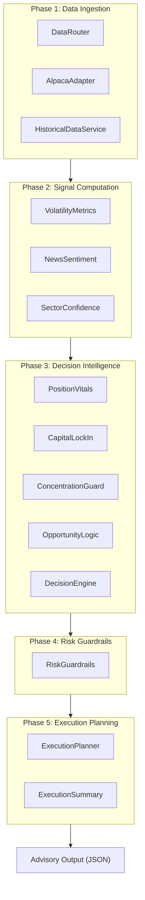
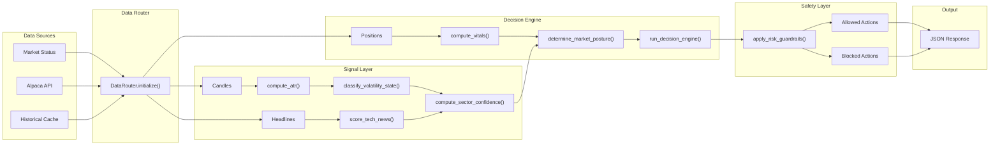
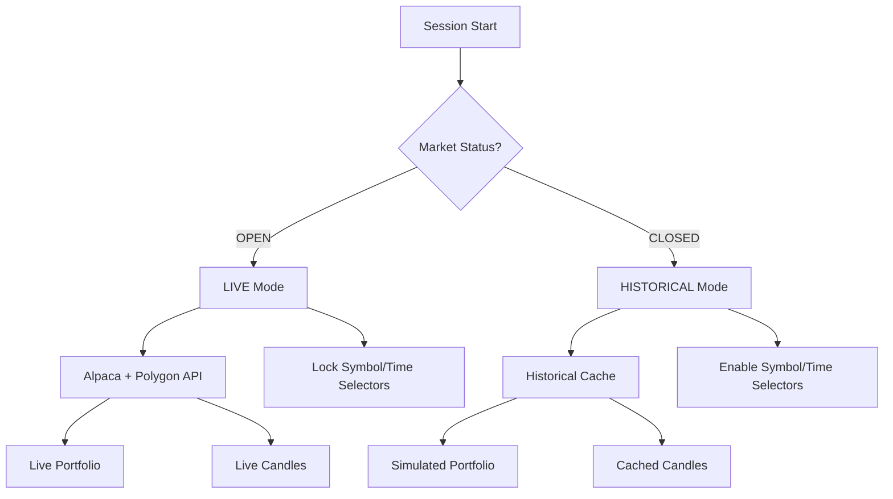
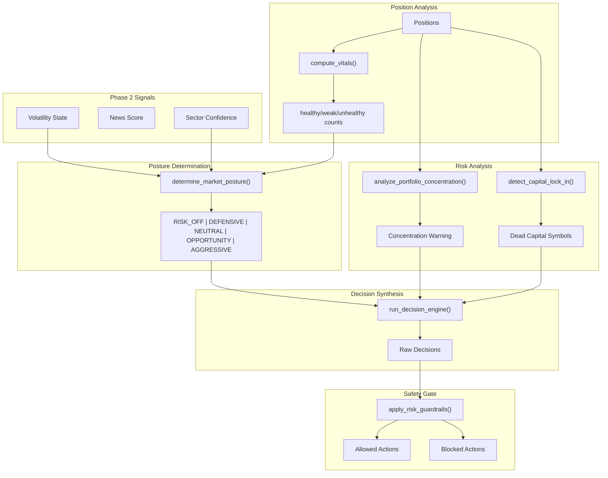
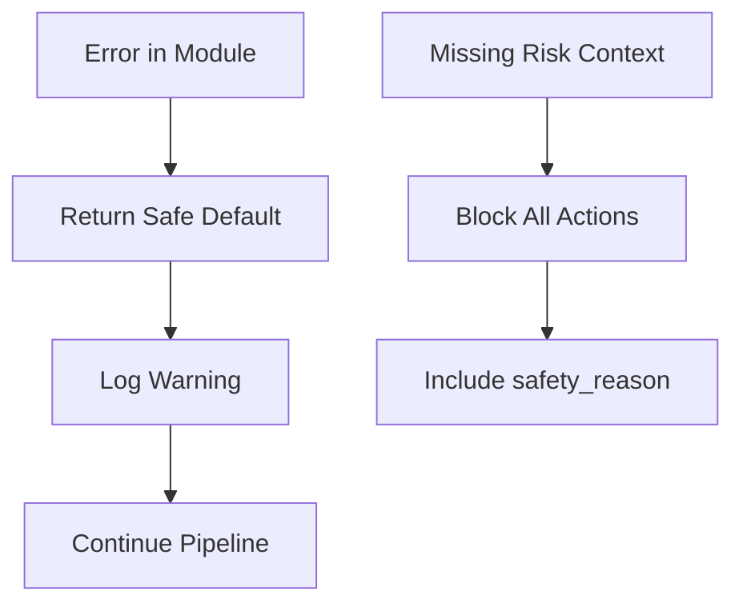
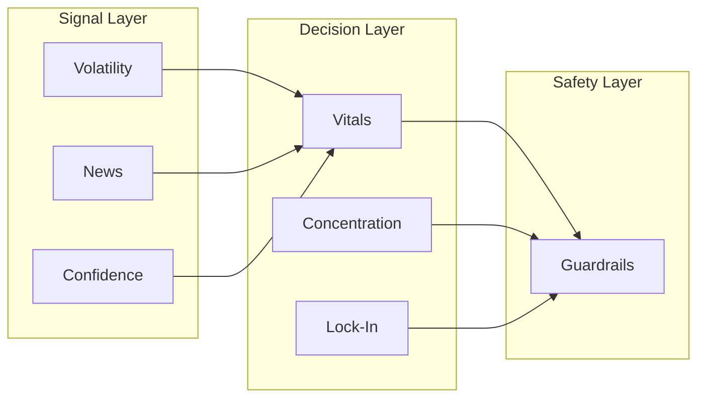

# Architecture & Data Contracts

This document defines the **system architecture, data flow, and module responsibilities** for the BuriBuri Trading Portfolio Intelligence System.

> **Advisory System Notice:** This is a read-only, advisory decision engine. It generates recommendations but intentionally disables all execution capabilities.

---

## Table of Contents

1. [High-Level Architecture](#high-level-architecture)
2. [System Flow](#system-flow)
3. [Decision Pipeline](#decision-pipeline)
4. [Module Responsibilities](#module-responsibilities)
5. [Data Contracts](#data-contracts)
6. [Failure & Fallback Behavior](#failure--fallback-behavior)
7. [Design Principles](#design-principles)

---

## High-Level Architecture

The system is organized into **5 sequential phases**, each with distinct responsibilities:



### Phase Responsibilities

| Phase | Name | Responsibility | Execution Scope |
|:-----:|:-----|:---------------|:----------------|
| **1** | Data Ingestion | Fetch portfolio, positions, candles | Market-aware routing |
| **2** | Signal Computation | Compute volatility, news score, confidence | Stateless transforms |
| **3** | Decision Intelligence | Analyze positions, synthesize decisions | Core reasoning |
| **4** | Risk Guardrails | Filter unsafe decisions | Safety gate |
| **5** | Execution Planning | Sequence approved actions | Advisory output |

### Advisory-Only Design

The system is intentionally designed as a **read-only advisor**:

- ❌ No broker order submission
- ❌ No portfolio mutations
- ❌ No external state changes
- ✅ Generates JSON recommendations
- ✅ Provides human-readable explanations
- ✅ Logs reasoning ("thought log")

---

## System Flow

### End-to-End Data Flow



### Market-Aware Data Routing

The `DataRouter` class determines data source based on market status:



**Strict Rules:**
1. Market OPEN → LIVE data only (no fallbacks)
2. Market CLOSED → HISTORICAL data only (no mixing)
3. Session Immutability: Data mode locked at session start

---

## Decision Pipeline

### Signal → Decision Flow



### Market Posture Logic

The system determines posture using a priority-based evaluation:

```
Priority 1: Internal Health (Portfolio Vitals)
    IF unhealthy_count > healthy_count → RISK_OFF

Priority 2: External Conditions (Volatility × Confidence)
    EXPANDING + low_confidence → DEFENSIVE
    EXPANDING + high_confidence → NEUTRAL
    CONTRACTING + high_confidence → AGGRESSIVE
    CONTRACTING + low_confidence → NEUTRAL
    STABLE + high_confidence → OPPORTUNITY
    STABLE + low_confidence → NEUTRAL
```

### Guardrail Rules

Safety rules are applied as the **final gate** before output:

| Rule | Trigger | Effect |
|:-----|:--------|:-------|
| **Sector Concentration** | Sector > 60% AND action increases exposure | BLOCK |
| **Cash Reserve** | Cash < $50,000 AND action requires capital | BLOCK |
| **Volatility × Aggression** | Volatility = EXPANDING AND action is aggressive | BLOCK |

---

## Module Responsibilities

### Phase 1: Data Ingestion

#### `data_router.py`

| Attribute | Value |
|:----------|:------|
| **Purpose** | Market-aware data source routing |
| **Inputs** | Market status, configuration |
| **Outputs** | Routing configuration, data accessors |
| **Dependencies** | `market_status.py`, `historical_data_service.py`, `broker/alpaca_adapter.py` |
| **Invariants** | Session immutability (mode locked at init), no silent fallbacks |

#### `broker/alpaca_adapter.py`

| Attribute | Value |
|:----------|:------|
| **Purpose** | READ-ONLY Alpaca paper trading client |
| **Inputs** | Environment credentials |
| **Outputs** | Portfolio, positions, candles |
| **Dependencies** | `requests`, Alpaca API |
| **Invariants** | Paper trading URL only, no write operations |

#### `historical_data_service.py`

| Attribute | Value |
|:----------|:------|
| **Purpose** | Historical data access from cache |
| **Inputs** | Symbol, time range |
| **Outputs** | Candles, generated portfolio/positions |
| **Dependencies** | JSON cache files in `historical_cache/` |
| **Invariants** | Returns only cached data, no API calls |

### Phase 2: Signal Computation

#### `volatility_metrics.py`

| Attribute | Value |
|:----------|:------|
| **Purpose** | ATR computation and volatility classification |
| **Inputs** | List of candles (OHLCV) |
| **Outputs** | `{ "atr": float }`, `{ "volatility_state": str }` |
| **Dependencies** | None (stateless) |
| **Invariants** | Returns `STABLE` on invalid input |

#### `news_scorer.py`

| Attribute | Value |
|:----------|:------|
| **Purpose** | Keyword-based sentiment scoring |
| **Inputs** | List of headline strings |
| **Outputs** | `{ "news_score": int }` (0-100) |
| **Dependencies** | None (stateless) |
| **Invariants** | Returns 50 (neutral) on empty input |

#### `sector_confidence.py`

| Attribute | Value |
|:----------|:------|
| **Purpose** | Combines volatility + news into confidence score |
| **Inputs** | `volatility_state`, `news_score` |
| **Outputs** | `{ "sector_confidence": int }` (0-100) |
| **Dependencies** | None (stateless) |
| **Invariants** | Always returns valid score |

### Phase 3: Decision Intelligence

#### `position_vitals.py`

| Attribute | Value |
|:----------|:------|
| **Purpose** | Position health and efficiency scoring |
| **Inputs** | Position dict |
| **Outputs** | `{ "vitals_score": float, "health": str, "suggested_action": str, "flags": list }` |
| **Dependencies** | None (stateless) |
| **Invariants** | Score always 0-100, handles missing fields |

#### `capital_lock_in.py`

| Attribute | Value |
|:----------|:------|
| **Purpose** | Detect dead capital in cold sectors |
| **Inputs** | Portfolio, positions, sector heatmap |
| **Outputs** | `{ "dead_positions": list, "reallocation_alert": bool, "pressure_score": float }` |
| **Dependencies** | None (stateless) |
| **Invariants** | Returns empty list on valid input |

#### `concentration_guard.py`

| Attribute | Value |
|:----------|:------|
| **Purpose** | Sector exposure monitoring |
| **Inputs** | Positions, total capital |
| **Outputs** | `{ "exposure_map": dict, "warning": ConcentrationWarning }` |
| **Dependencies** | None (stateless) |
| **Invariants** | Returns `is_concentrated: False` on empty input |

#### `opportunity_logic.py`

| Attribute | Value |
|:----------|:------|
| **Purpose** | Compare weak positions against candidates |
| **Inputs** | Analyzed positions, candidates |
| **Outputs** | `{ "better_opportunity_exists": bool, "confidence": str }` |
| **Dependencies** | None (stateless) |
| **Invariants** | Returns `False` when no candidates |

#### `decision_engine.py`

| Attribute | Value |
|:----------|:------|
| **Purpose** | Core orchestrator for decision synthesis |
| **Inputs** | Portfolio, positions, heatmap, candidates, market_context, execution_context |
| **Outputs** | Full decision report (see Data Contracts) |
| **Dependencies** | All Phase 2 and Phase 3 modules |
| **Invariants** | Always returns valid output structure |

### Phase 4: Risk Guardrails

#### `risk_guardrails.py`

| Attribute | Value |
|:----------|:------|
| **Purpose** | Final safety filtering |
| **Inputs** | Proposed decisions, risk context |
| **Outputs** | `{ "allowed_actions": list, "blocked_actions": list }` |
| **Dependencies** | None (stateless) |
| **Invariants** | Blocks all on missing context, never crashes |

### Phase 5: Execution Planning

#### `execution_planner.py`

| Attribute | Value |
|:----------|:------|
| **Purpose** | Sequence approved actions by priority |
| **Inputs** | Decision output, positions |
| **Outputs** | `{ "proposed_actions": list }` |
| **Dependencies** | None (stateless) |
| **Invariants** | Weak positions addressed first |

---

## Data Contracts

### Position

A single open trade consumed by Phase 3 modules.

```python
{
    "symbol": str,              # Required. Ticker symbol (e.g., "NVDA")
    "sector": str,              # Required. Sector classification (e.g., "TECH")
    "entry_price": float,       # Required. Average entry price
    "current_price": float,     # Required. Current market price
    "atr": float,               # Required. Average True Range
    "days_held": int,           # Required. Calendar days since entry
    "capital_allocated": float  # Required. USD capital in position
}
```

#### Fallback Behavior

| Field | Default | Effect |
|:------|:--------|:-------|
| `symbol` | `"UNKNOWN"` | Logged but continues |
| `sector` | `"UNKNOWN"` | Excluded from concentration |
| `entry_price` | `0.0` | **Error**: Cannot compute PnL |
| `atr` | `0.0001` | Prevents division-by-zero |
| `days_held` | `0` | No time penalty |
| `capital_allocated` | `1.0` | Prevents division-by-zero |

---

### Portfolio

Overall account state consumed by decision engine.

```python
{
    "total_capital": float,     # Required. Total account value (USD)
    "cash": float,              # Required. Available cash (USD)
    "used_capital": float       # Optional. Reserved for future use
}
```

---

### Market Candle

OHLCV data for volatility computation.

```python
{
    "timestamp": str,           # ISO 8601 format
    "open": float,
    "high": float,
    "low": float,
    "close": float,
    "volume": int
}
```

**Notes:**
- Candles should be sorted oldest-first
- ATR requires at least 15 candles (14-period + 1)

---

### Sector Heatmap

Sector opportunity intensity scores.

```python
{
    "TECH": int,        # 0-100. Higher = more attractive
    "ENERGY": int,
    "FINANCE": int,
    ...
}
```

| Score | Label | Meaning |
|:------|:------|:--------|
| ≥ 70 | Hot | High opportunity |
| 40-69 | Neutral | No strong signal |
| < 40 | Cold | Avoid or exit |

---

### Candidate

Potential new trade for evaluation.

```python
{
    "symbol": str,                  # Required. Ticker symbol
    "sector": str,                  # Required. Sector classification
    "projected_efficiency": float   # Required. Expected vitals score (0-100)
}
```

---

### Decision Output

Complete output from `run_decision_engine()`:

```python
{
    "pm_summary": str,              # Human-readable portfolio manager summary
    "market_posture": {
        "market_posture": str,      # RISK_OFF | DEFENSIVE | NEUTRAL | OPPORTUNITY | AGGRESSIVE
        "risk_level": str,          # HIGH | MEDIUM | LOW
        "confidence": int,          # 0-100
        "reasons": list[str]        # Human-readable explanations
    },
    "superiority_analysis": {
        "primary_decision": dict,   # Highest-priority approved action
        "alternatives_considered": list,
        "decision_confidence": float,
        "dominance_check": dict     # Inaction justification if applicable
    },
    "decisions": list[dict],        # Approved actions
    "blocked_by_safety": list[dict],# Blocked actions with safety_reason
    "concentration_risk": dict,     # ConcentrationWarning
    "reallocation_trigger": bool,
    "opportunity_scan": dict,
    "pressure_score": float
}
```

---

### Risk Context

Input to `apply_risk_guardrails()`:

```python
{
    "concentration": {
        "is_concentrated": bool,
        "dominant_sector": str,
        "severity": str,            # OK | APPROACHING | SOFT_BREACH
        "exposure": float           # 0.0 to 1.0
    },
    "cash_available": float,
    "minimum_reserve": float,       # Default: 50000.0
    "volatility_state": str         # EXPANDING | STABLE | CONTRACTING
}
```

---

## Failure & Fallback Behavior

### Defensive Defaults

Every module is designed to be crash-proof:

| Scenario | Behavior |
|:---------|:---------|
| Missing candles | ATR returns `None`, volatility defaults to `STABLE` |
| Missing headlines | News score defaults to `50` (neutral) |
| Missing positions | Empty decisions list, no errors |
| Missing risk context | All actions blocked with reason |
| API connection error | Returns error status, no silent fallback |
| Invalid position data | Skipped with logged warning |

### Error Propagation



### No Silent Fallbacks

The system enforces strict data source integrity:

- ❌ No fallback from live to historical during market hours
- ❌ No mixing of data sources within a session
- ✅ Clear error status when data unavailable
- ✅ Session locked to initial data mode

---

## Design Principles

### 1. Determinism

- All decision logic is rule-based
- No random components in core pipeline
- Same inputs → Same outputs
- No ML/AI heuristics

### 2. Explainability

- Every decision includes `reasons` array
- Every block includes `safety_reason`
- "Thought log" tracks reasoning stream
- PM summary generated for each run

### 3. Separation of Concerns



- Signal computation is stateless
- Decision logic is modular
- Safety is a separate layer (not embedded)

### 4. Safety-First Defaults

| Principle | Implementation |
|:----------|:---------------|
| When in doubt, BLOCK | Missing context → block all |
| Safety > Strategy | Guardrails override decisions |
| Defensive posture | STABLE default on unknown state |
| Explainable blocks | Every block has a reason |

### 5. Session Immutability

- Market status locked at session start
- No mid-session data source switching
- Ensures consistent analysis runs

---

## Module Dependency Diagram

```mermaid
graph TD
    subgraph "Entry Points"
        CLI["full_system_demo.py"]
        API["backend/app.py"]
        Runner["market_aware_runner.py"]
    end
    
    subgraph "Data Layer"
        DR["data_router.py"]
        MM["market_mode.py"]
        MS["market_status.py"]
        HDS["historical_data_service.py"]
        AA["broker/alpaca_adapter.py"]
        MA["broker/mock_adapter.py"]
    end
    
    subgraph "Signal Layer"
        VM["volatility_metrics.py"]
        NS["news_scorer.py"]
        SC["sector_confidence.py"]
    end
    
    subgraph "Intelligence Layer"
        PV["position_vitals.py"]
        CLI_lock["capital_lock_in.py"]
        CG["concentration_guard.py"]
        OL["opportunity_logic.py"]
        DE["decision_engine.py"]
        DX["decision_explainer.py"]
    end
    
    subgraph "Safety Layer"
        RG["risk_guardrails.py"]
    end
    
    subgraph "Output Layer"
        EP["execution_planner.py"]
        ES["execution_summary.py"]
    end
    
    CLI --> DR
    API --> DR
    Runner --> DR
    
    DR --> MM
    DR --> HDS
    DR --> AA
    
    DE --> VM
    DE --> NS
    DE --> SC
    DE --> PV
    DE --> CLI_lock
    DE --> CG
    DE --> OL
    DE --> DX
    DE --> RG
    
    RG --> EP
```



---

## Quick Reference: Required Fields

| Data Type | Required Fields |
|:----------|:----------------|
| Position | `symbol`, `sector`, `entry_price`, `current_price`, `atr`, `days_held`, `capital_allocated` |
| Portfolio | `total_capital`, `cash` |
| Candle | `timestamp`, `high`, `low`, `close` |
| Candidate | `symbol`, `sector`, `projected_efficiency` |
| Sector Heatmap | At least one sector key-value pair |

---

## Versioning

| Version | Date | Changes |
|:--------|:-----|:--------|
| **v1.0** | 2026-01-31 | Initial data contracts |
| **v2.0** | 2026-02-01 | Added architecture diagrams, market-aware routing, full module documentation |

---

_© 2026 BuriBuri Trading Team_
